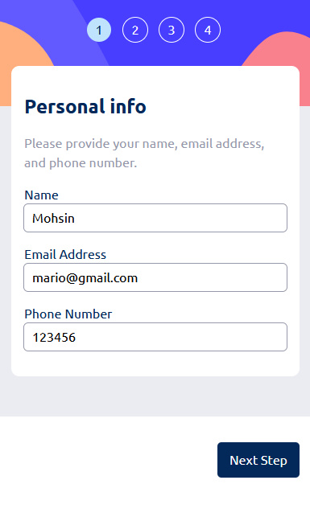
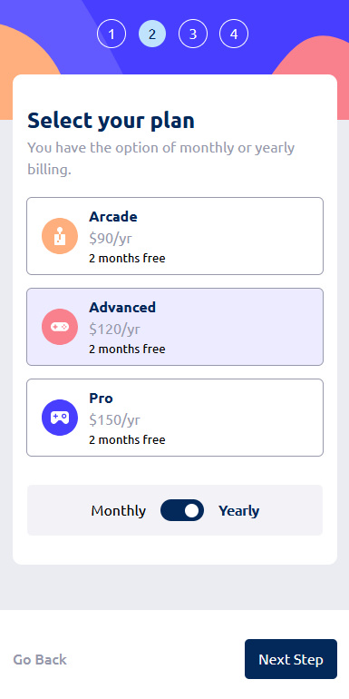

# Frontend Mentor - Multi-step form solution

This is a solution to the [Multi-step form challenge on Frontend Mentor](https://www.frontendmentor.io/challenges/multistep-form-YVAnSdqQBJ). 

## Table of contents

- [Overview](#overview)
  - [The challenge](#the-challenge)
  - [Screenshot](#screenshot)
  - [Links](#links)
- [My process](#my-process)
  - [Built with](#built-with)
  - [Useful resources](#useful-resources)
- [Author](#author)

## Overview

### The challenge

Users should be able to:

- Complete each step of the sequence
- Go back to a previous step to update their selections
- See a summary of their selections on the final step and confirm their order
- View the optimal layout for the interface depending on their device's screen size
- See hover and focus states for all interactive elements on the page
- Receive form validation messages if:
  - A field has been missed
  - The email address is not formatted correctly
  - A step is submitted, but no selection has been made

### Screenshot

### Links

- Solution URL: [Add solution URL here](https://www.frontendmentor.io/solutions/multistep-form-using-react-formik-and-framermotion--Pbsh-KuZr)
- Live Site URL: [Add live site URL here](https://mohsin316.github.io/multi-step-form/)

## My process

I built this with the help of react, formik and framer motion. Im glad it turned out the way it did. Only issue is when the user does not select a plan and decides to go to the previous component, they will not be able to go forward as clicking the next button submits the form and formik will not allow this as they have not selected a plan which is a required field. If anyone can find a better solution to that do let me know!

### Built with

- Semantic HTML5 markup
- CSS custom properties
- Flexbox
- CSS Grid
- Mobile-first workflow
- [React](https://reactjs.org/) - JS library
- Formik library
- Framer motion
### Useful resources

- [net ninja](https://netninja.dev/courses) - This helped me for Studying javascript. I really liked this course and i highly recommend to begginers.
- [Kevin Powell](https://www.youtube.com/kepowob) - This person is extremely talented and has helped me learn most of the things i know in CSS. highly recommend to anyone who is studying CSS.
## Author

- [My website](https://mohsins-solutions.netlify.app/)
- Frontend Mentor - [@mohsin316](https://www.frontendmentor.io/profile/mohsin316)
- Twitter - [@Mohsin_316](https://twitter.com/Mohsin_316)
- Linkedin - [Mohsin Miyaji](https://www.linkedin.com/in/mohsin-miyaji-084b00229/)